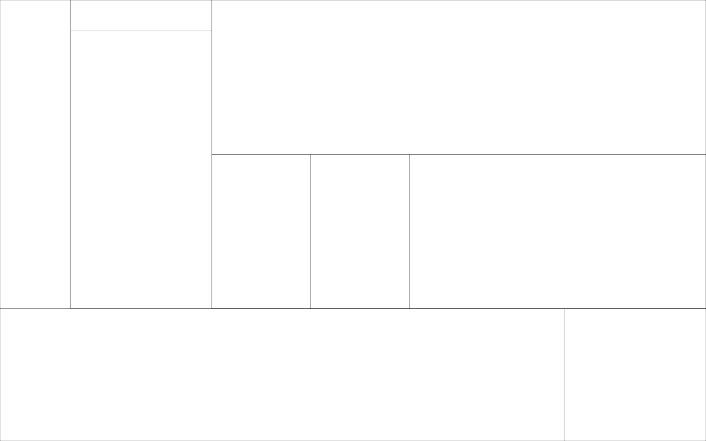
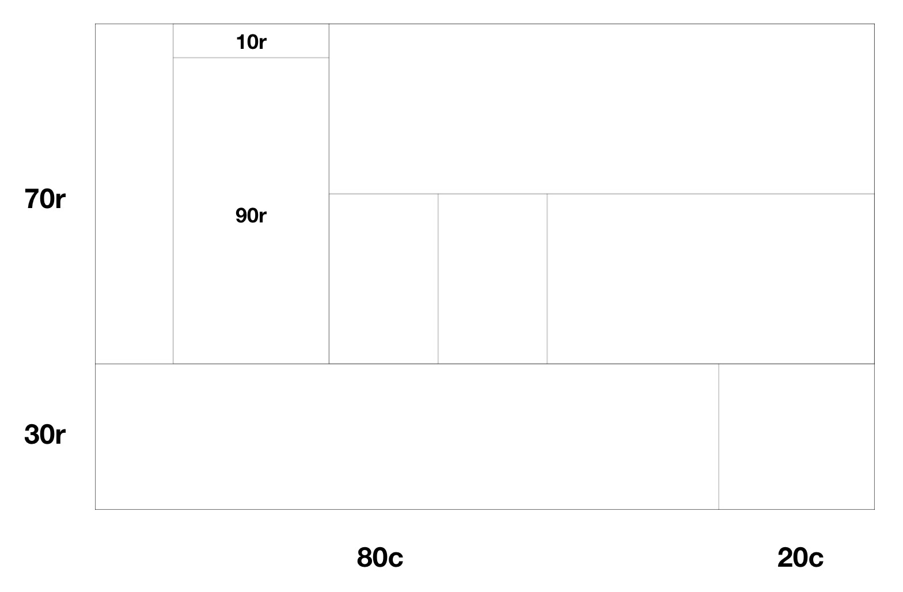

# `griddy`: Generate CSS grid layouts FAST
<p align=center>

</p>

> 📐📏 Tired of manually splitting `<div>`'s? Try **`griddy`**.
## Setup 
### Build from source
```
git clone https://github.com/Mckinsey666/griddy.git
cd griddy
pip install .
```
### From **PyPI**
```
pip install griddy
```

## Usage
### Defining a `layout.json` file
A layout `.json` file should follow the following syntax:
- The json file contains one `json` object.
- First level of the `json` object should have key `root`.
- For (key, value) pairs in other levels, the keys should abide by the following conventions:
    - `percentage`: percentage of the children `<div>`'s height or width with respect to its parent's.
    - `layout type`: defines a column layout or a row layout (column layouts will be inside a flex container). If `r` is specified, the percentage is the relative height; if `c` is specified, the percentage is the relative width.
    - `id` (optional): used to prevent duplicate keys in the `json` object.

```
key = percentage + layout type + id
```

- For keys in the same level, their layout types should be the same.
- For keys in the same level, it is better that their percentage add up to 100.
- If no more `<div>`s are to be splitted, set the value of the key to be `null`.

#### Sample `layout.json` file
```json
{
    "root":{
        "70r":{
            "10c": null,
            "20c": {
                "10r": null,
                "90r": null
            },
            "70c": {
                "50r1": null,
                "50r2": {
                    "20c1": null,
                    "20c2": null,
                    "60c": null
                }
            }
        },
        "30r": {
            "80c": null,
            "20c": null
        }
    }
}
```
Play with more examples in the `examples` directory.

#### Sample `index.html` output

<p align=center>

</p>

Here `<div>` blocks are randomly colored for the sake of clarity with the `--colored` flag specified.

<p align=center>

</p>

Plain borders surrounding blocks with `--border` flag specified.

<p align=center>

</p>

The above picture shows how the `json` file syntax associates with actual layout generated.

### Generate `html` and `css`
```
griddy <name of the layout file>
```
An `index.html` file and a `styles.css` file will be generated in the current working directory. You can simply plugin the generated grid `<div>` (top-level `<div>` of class `root` with style `width: 100%; height:100%`) anywhere in your existing code.

### Command-line arguments
|Arguments|Type|Explanation|
|---|---|---|
|**--colored**|bool|Whether to color the `<div>` blocks|
|**--border**|bool|`<div>` blocks comes with borders|
|**--show**|bool|Show generated grid in browser|

For example,
```
griddy layout.json --border --show
```